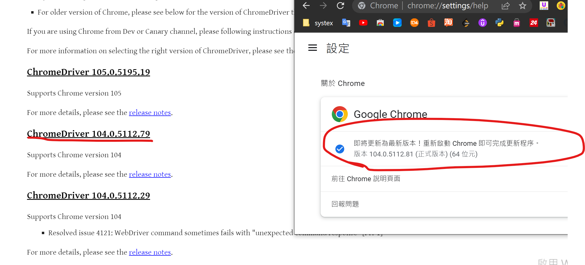
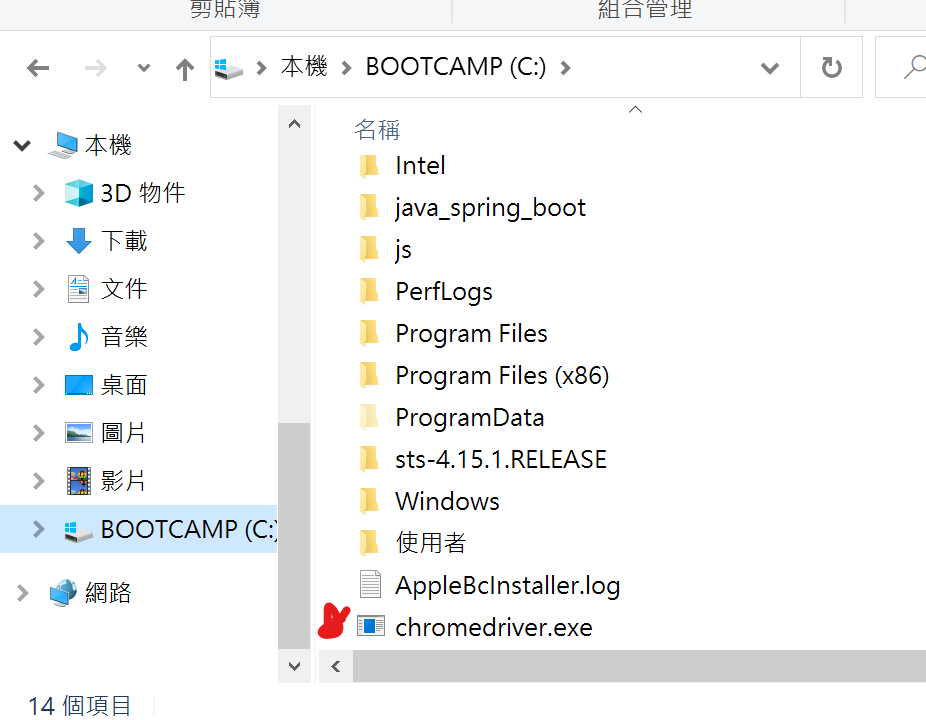

# Setup Environment
* python
* pycharm
* git bash
* github
* WinOS
* ChromeDriver
* https://github.com/sivelll/robot

<mark>2022/8/19 Update ChromeDriver</mark> 
<mark>2022/9/19 System EIP Update</mark> 
<mark>2022/9/21 Code Update Done</mark>
# Download ChromeDriver
* Download
 
* Put in disk C
 
# Clone this project
* open git bash
 
* copy github url
 
* git clone https://github.com/sivelll/fstop_system_punch_in-.git
 
# PyCharm
* setting
 
* add interpreter
 
* install requirements
 
* Edit your username and password
 
# Edit Run.bat
* Change your path
 
# Routine Punch In
* computer management
 
* add new work
 
* setup trigger
 
* movement
 

