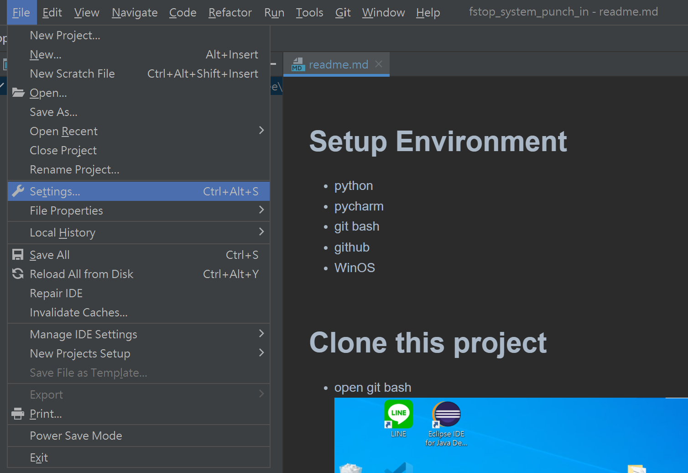
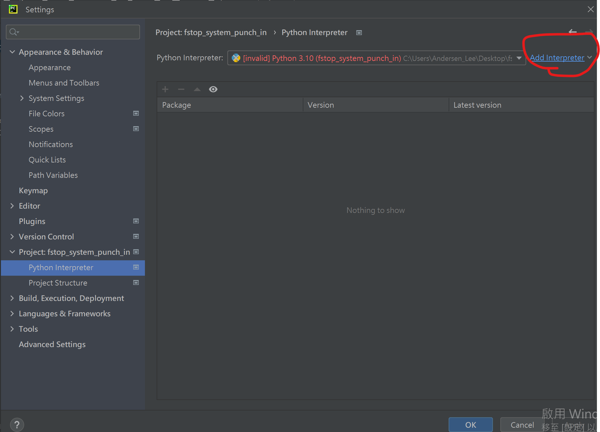
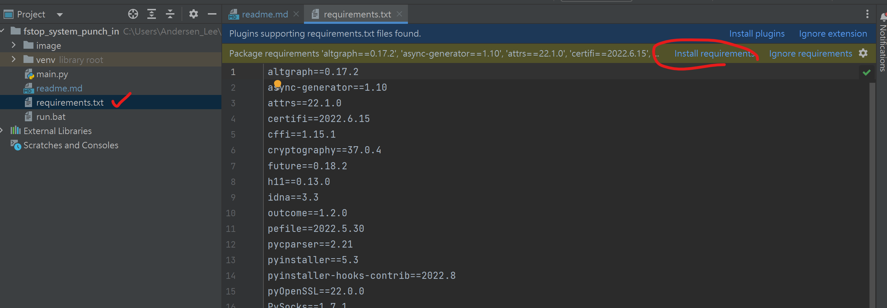
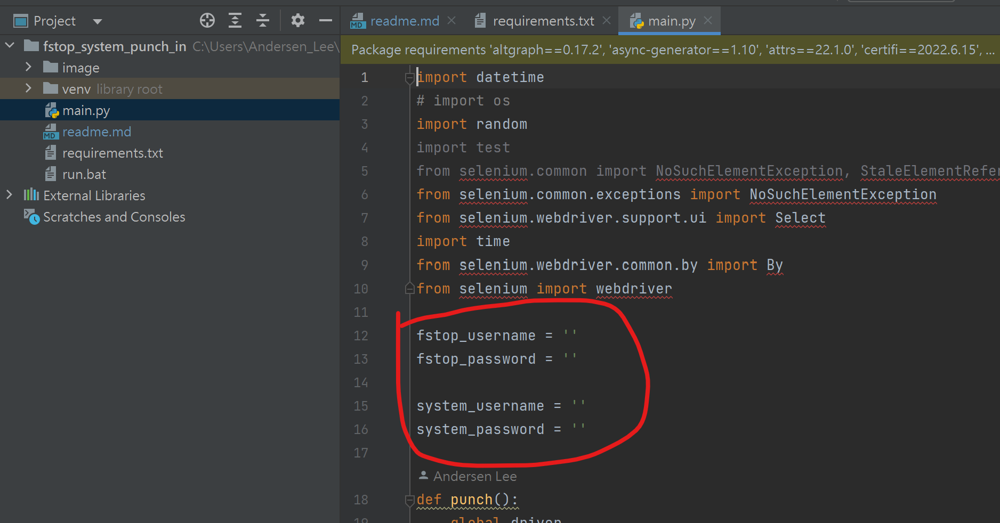
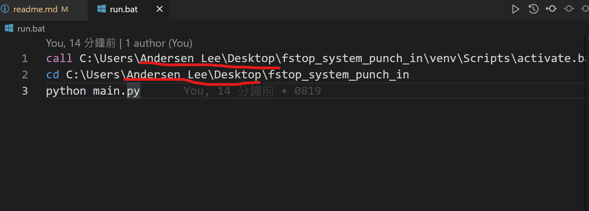

# Setup Environment
* python
* pycharm
* git bash
* github
* WinOS

# Clone this project
* open git bash

* copy github url

* git clone https://github.com/sivelll/fstop_system_punch_in-.git

# PyCharm
* setting

* add interpreter

* install requirements

* Edit your username and password

# Edit Run.bat
* Change your path

# Routine Punch In
* computer management

* add new work

* setup trigger

* movement

